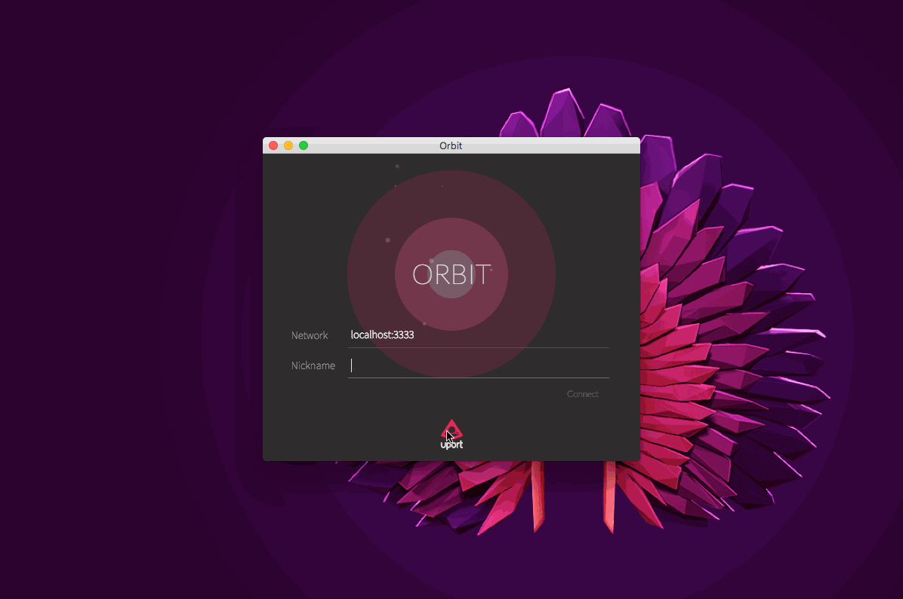
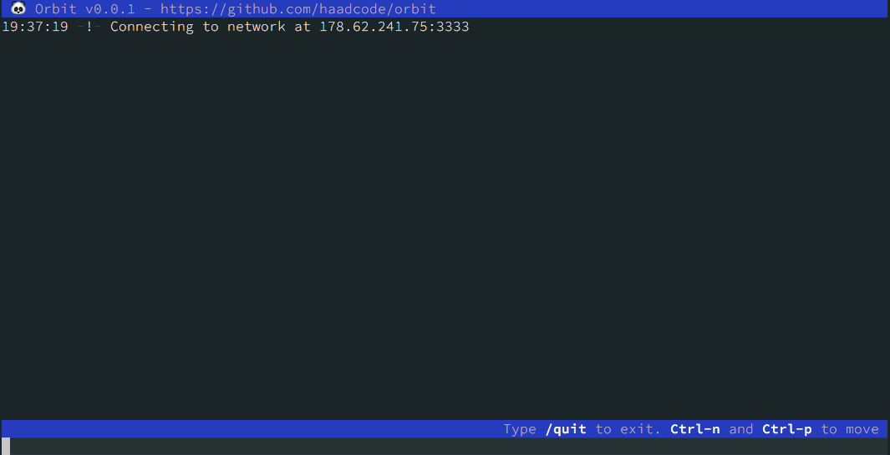

# IPFS Newsletter #11

[IPFS](//ipfs.io/) is a content addressed, hypermedia distribution protocol, to make the web faster, safer, and more open. In these posts, we highlight some of the development that has happened since the IPFS workshop in Lisbon in late July.

For anyone looking to get involved, follow the embedded hyperlinks, search the wealth of information on [GitHub](//github.com/ipfs) or join us on [IRC](//webchat.freenode.net/?channels=ipfs) (#ipfs on the Freenode network).

If you would like to get this update as an email, sign up for our [newsletter](//tinyletter.com/ipfsweekly)!

## Contents

- [Updates](#updates)
  - [[Orbit](https://github.com/haadcode/orbit)](#orbithttpsgithubcomhaadcodeorbit)
  - [[go-ipfs](//github.com/)](#go-ipfsgithubcom)
  - [[js-ipfs](https://github.com/ipfs/js-ipfs)](#js-ipfshttpsgithubcomipfsjs-ipfs)
  - [[libp2p](https://github.com/libp2p)](#libp2phttpsgithubcomlibp2p)
  - [[IPLD](https://github.com/ipld/specs)](#ipldhttpsgithubcomipldspecs)
  - [[Multiformats](https://github.com/multiformats/multiformats)](#multiformatshttpsgithubcommultiformatsmultiformats)
- [Community](#community)
  - [DevCon 2](#devcon-2)
  - [Beaker Browser - Navigate sites on IPFS and Dat](#beaker-browser---navigate-sites-on-ipfs-and-dat)
  - [Primoca](#primoca)
  - [Mango: Git completely Decentralized](#mango-git-completely-decentralized)
  - [How to serve a website over IPFS](#how-to-serve-a-website-over-ipfs)
  - [Swag](#swag)
- [Contributors](#contributors)

## Updates

### [Orbit](https://github.com/haadcode/orbit)

Orbit, the decentralized chat app run on top of IPFS, has just integrated uPort identities. There's a writeup on what uPort is [on Medium](https://medium.com/@ConsenSys/uport-the-wallet-is-the-new-browser-b133a83fe73) - essentially, it is a web-based wallet and identity management system. This means that users will be able to use their uPort name and profile picture in Orbit, as well as provision a signing key that will sign Orbit messages. We've been working with [ConsenSys](https://consensys.net/) to make this happen. You can track this [here](https://github.com/haadcode/orbit/issues/37).

If you're going to Ethereum Foundation's [Devcon2](https://ethereumfoundation.org/devcon), @haadcode will dome the integration and talk about the implementation details on [21st of September](https://ethereumfoundation.org/devcon/?page_id=14) at the conference. Come see the talk!

Orbit also now has a [terminal client](https://github.com/haadcode/orbit-textui). This uses [blessed](https://github.com/chjj/blessed), a curses-like library with a high level terminal interface API for Node.js. This means you can chat to people using Orbit, straight from where you get your work done, in the terminal.

If you're interested in getting involved with developing Orbit, we've been adding a lot more 'Help Wanted' labels to issues that we think could use some work. Look at [these issues](https://github.com/haadcode/orbit/issues?q=is%3Aopen+is%3Aissue+label%3A%22help+wanted%22+sort%3Areactions-%2B1-desc) and dive in. If you have questions, just jump on [the IRC channel](https://webchat.freenode.net/?channels=%23ipfs), or comment on the issues themselves.

### [go-ipfs](//github.com/)

We've updated `go-ipfs` to 0.4.3-rc3 on August 8th. 0.4.2 is still the stable version; however, if you're interested in trying out the release candidates, take a look at the binaries on [dist.ipfs.io](https://dist.ipfs.io/go-ipfs). The 0.4.3-rc comes with a couple of nice enhancements, and improves the performance of storage, bitswap, as well as content and peer routing. It also introduces a handful of new commands and options, and fixes a good bunch of bugs: you can take a look at the full changelog [here](https://github.com/ipfs/go-ipfs/blob/master/CHANGELOG.md).

Moving to go1.7 is in the works, as it will give us performance improvements, `context` has been added into stdlib, and `net.DialContext` will allow us to improve resource consumption and downtime. It also adds support for macOS Sierra. [Track that here](https://github.com/ipfs/go-ipfs/issues/3093).

We're working on getting code coverage for all of the packages included in go-ipfs. To follow along or comment, [go here](https://github.com/ipfs/go-ipfs/issues/3053). We also plan on using coveralls to have solid tests for subprojects; follow that [here](https://github.com/ipfs/go-ipfs/issues/3112).

On a related note, [gx](https://github.com/whyrusleeping/gx/), our packer manager for go-ipfs and go-libp2p, is now easier to use, as @whyrusleeping udpated `gx deps --tree`, and it's related options.

Moving forward, we have a few main goals: Shipping IPFS with IPLD, interop with js-ipfs, and reliability and reducing resource consumption. @whyrusleeping has written a [Captain's Log](https://github.com/ipfs/go-ipfs/issues/2247#issuecomment-238675394) outlining his vision of what is happening and where to track changes. If you're interested in getting involved with developing go-ipfs, we've been adding a lot more 'Help Wanted' labels to issues (just like we have for Orbit). Look at [these issues](https://github.com/ipfs/go-ipfs/issues?q=is%3Aopen+is%3Aissue+label%3A%22help+wanted%22) and dive in. If you have questions, just jump on [the IRC channel](https://webchat.freenode.net/?channels=%23ipfs), or comment on the issues themselves.

### [js-ipfs](https://github.com/ipfs/js-ipfs)

js-ipfs has been moving fast. Since our workshop in Lisbon, we have established a [Roadmap](https://github.com/ipfs/js-ipfs/blob/master/ROADMAP.md) for the way forward. The new roadmap has very specific milestones, which you can read about there; here is a tl:dr;

- [✔️ ~~Milestone 1 - js-ipfs on the browser~~](https://github.com/ipfs/js-ipfs/blob/master/ROADMAP.md#milestone-1---js-ipfs-on-the-browser)
- [Milestone 2 - Quality and correctness of the JavaScript Implementation](https://github.com/ipfs/js-ipfs/blob/master/ROADMAP.md#milestone-2---quality-and-correctness-of-the-javascript-implementation)
- [Milestone 3 - Enter IPLD - Enable js-ipfs to handle both merkledag protobufs and ipld cbor objects](https://github.com/ipfs/js-ipfs/blob/master/ROADMAP.md#milestone-3---enter-ipld---enable-js-ipfs-to-handle-both-merkledag-protobufs-and-ipld-cbor-objects)
- [Milestone 4 - Documentation and Developer Experience](https://github.com/ipfs/js-ipfs/blob/master/ROADMAP.md#milestone-4---documentation-and-developer-experience)
- [Milestone 5 - 1st implementation Peer Routing + Content Routing (the go-ipfs DHT)](https://github.com/ipfs/js-ipfs/blob/master/ROADMAP.md#milestone-5---1st-implementation-peer-routing--content-routing-the-go-ipfs-dht)
- [Milestone 6 - The last miles for complete feature parity with go-ipfs](https://github.com/ipfs/js-ipfs/blob/master/ROADMAP.md#milestone-6---the-last-miles-for-complete-feature-parity-with-go-ipfs)

The [js-ipfs-api](https://github.com/ipfs/js-ipfs-api) v7 has now been shipped; a full exposition of this and the thinking behind it can be found [here](https://github.com/ipfs/js-ipfs-api/pull/305). The short story is that it now has 30% more files interfacing, which means more interop with go-ipfs and more you can do with it. For future changes, [follow this issue](https://github.com/ipfs/interface-ipfs-core/issues/55), which will communicate interface changes on js-ipfs and js-ipfs-api.

We're moving to pull-streams as the Control Flow library to use in order to solve the hiccups we have had in the past with Node.js Streams. This discussion took a lot of input from several people familiar with the js-ipfs project. You can read the whole thread [here](https://github.com/ipfs/js-ipfs/issues/362).

The js-ipfs CLI also got an upgrade. We moved from ronin to yargs, a more supported and used CLI toolkit that enables us to have menus for the js-ipfs CLI just like go-ipfs has.

On a small note: js-ipfs, like all of the IPFS projects, is heavily modular, so subscribing to a single repository is not always the optimal way to get updates. We tend to refactor out anything small enough to be its own meaningful module. For a full discussion about where we are with js-ipfs, please check out @diasdavid's [Captain's Log](https://github.com/ipfs/js-ipfs/issues/30#issuecomment-239642234)

### [libp2p](https://github.com/libp2p)

We have recently created the [libp2p](https://github.com/libp2p) organization, with the goal of building a modularized and extensible network stack to overcome the networking challenges faced when doing peer-to-peer applications. libp2p is used by IPFS as its networking library. Libp2p comprises both JavaScript and Go libraries, and already has dozens of repos. You can check out the main repository, describing our efforts, here: [libp2p/libp2p](https://github.com/libp2p/libp2p).

### [IPLD](https://github.com/ipld/specs)

IPLD, InterPlanetary Linked Data, now also has its own organization on GitHub. The [IPLD Draft](https://github.com/ipld/specs/tree/master/ipld) can be found there, currently; now has never been a more exciting time to get involved, as we are prioritizing writing a formal specification and also implementing it in go-ipfs and js-ipfs. @nicola, the leader on this, has been writing updates on the project in IPLD's own [Captain's Log](https://github.com/ipld/specs/issues/13). Subscribe to keep up to date.

There are many discussions which are open and active: [relative paths](https://github.com/ipld/specs/issues/1), [link properties](https://github.com/ipld/specs/issues/2), and dealing with [mutability](https://github.com/ipld/specs/issues/9) being just a few of them. Any issue labelled [spec](https://github.com/ipld/specs/issues?q=is%3Aissue+is%3Aopen+label%3Aspec) would be great to dive into.

As well, IPLD is [being discussed](https://github.com/mediachain/mediachain/issues/158) as something to bring into [Mediachain](http://mine.nyc/), and [nix](https://github.com/NixOS/nix/issues/859). Finally, we're going to have a website coming soon, so watch this space. 

### [Multiformats](https://github.com/multiformats/multiformats)

[Multiformats](https://github.com/multiformats) _also_ now has a GitHub organization. The Multiformats are a collection of protocols which aim to future-proof systems, today. They do this mainly by allowing data to be self-describable. This allows interoperability, protocol agility, and helps us avoid lock in. Currently, we have the following protocols (both works in progress and implemented):

- [multiaddr](https://github.com/multiformats/multiaddr): network addresses
- [multibase](https://github.com/multiformats/multibase): base encodings
- [multicodec](https://github.com/multiformats/multicodec): serialization codes
- [multihash](https://github.com/multiformats/multihash): cryptographic hashes
- [multikey](https://github.com/ipfs/specs/issues/58): cryptographic keys and artifacts
- [multistream](https://github.com/multiformats/multistream): stream wire protocols

As well as the specs, the Multiformats organization also includes several implementations, in many languages (JavaScript, Go, php, Rust, Scala...). To see a full list, look at the landing repository for the organization, [here](https://github.com/multiformats/multiformats). We will have a website up for this, shortly, too.

## Community

### DevCon 2

The IPFS team - in this case, @haadcode, @diasdavid, @whyrusleeping, and of course @jbenet -- are gearing up to go to the Ethereum Devcon 2 in Shanghai. Stop by and say hi if you are there!

### Beaker Browser - Navigate sites on IPFS and Dat

@pfrazee has launched [Beaker Browser](https://pfrazee.github.io/2016/08/10/beaker-browser-0.1.html) version 0.1.0, as a "developer preview", which is an Electron-based browser.

From their website:

> Beaker is a browser, but it's specifically a solution for putting decentralization protocols and APIs together, so we can stay lean and work together. It's called "Beaker" to signify that it's a place for experimentation, and a place to take risks. It's a pre-standards browser, so to speak; a place to try a technology without writing a spec first. And, it's been made to pursue that mandate of decentralization: that we disconnect presentation from services, that we improve confidentiality, and that we remove the advantages that keep large businesses in control of the Web.

You can find out more about it [here](https://pfrazee.github.io/2016/08/10/beaker-browser-0.1.html), [watch the demo video](https://www.youtube.com/watch?v=nKHJ4rLN9mo), read the [Hacker News discussion](https://news.ycombinator.com/item?id=12270762), or go straight to the GitHub repo and download the binary [here](https://github.com/pfrazee/beaker). Some future plans involve possibly integrating [scuttlebutt](https://scuttlebot.io/more/protocols/secure-scuttlebutt.html).

### Primoca

[Primoca](https://www.primoca.com/), an interactive code sharing environment, has hooked up a browser extension to a local IPFS daemon, which means that publishing code on Primoca is dependant entirely on IPFS. You can test it out [here](https://run.primoca.com/QmWb4sq11uZEdHk78nSocFVNRSMFcW3NnUrvH3ZnFvbgyT#script=QmQXp7maEfSs4w1QtpJ1VDpRvStNmXK4tXPKP7VtjVy63C). 

### Mango: Git completely Decentralized

@alexberegszaszi wrote an [outstanding Medium article](https://medium.com/@alexberegszaszi/mango-git-completely-decentralised-7aef8bcbcfe6#.7i4vgwihz) introducing [Mango](https://github.com/axic/mango), a backend for Git that uses Ethereum and IPFS (or Swarm). In their system, all Git objects (metadata and data) are stored on IPFS, while an Ethereum smart contract provides means for access control and stores the pointers to the latest repository revisions.

### How to serve a website over IPFS

Etienne Laurin wrote up a guide on [how to serve a website on IPFS](http://www.atnnn.com/p/ipfs-hosting/), which lays out the workflow for going from a traditional website to an IPFS-based one. The site itself, of course, is also hosted on IPFS. If you're looking to publish your own site, this is a good place to start.

### Swag

We have now emailed out stickers to a ton of hackerspaces and individuals. Let us know if you would like some: @RichardLitt would be happy to send out a few more.

## Contributors

Across the entire IPFS GitHub organization, the following people have committed code, created issues, or made a comment on GitHub between __Date__ (noon, GMT) and __Date__. We're autogenerating this list using [this tool](//github.com/ipfs/weekly/blob/master/tools/get_commits.py) and [this other tool](//github.com/richardlitt/name-your-contributors), so please let us know if your name isn't here.

- [@18dew](//github.com/18dew) (thedewer)
- [@AdamStone](//github.com/AdamStone) (Adam Stone)
- [@adrian-git-hub-user](//github.com/adrian-git-hub-user)
- [@aeschylus](//github.com/aeschylus)
- [@aistich](//github.com/aistich) (aistich)
- [@alexander255](//github.com/alexander255) (Alexander Schlarb)
- [@alikic](//github.com/alikic)
- [@amstocker](//github.com/amstocker) (Andrew Stocker)
- [@anarcat](//github.com/anarcat) (anarcat)
- [@apiarian](//github.com/apiarian) (Aleksandr Pasechnik)
- [@arithmetric](//github.com/arithmetric) (Joe Turgeon)
- [@ascribe0](//github.com/ascribe0)
- [@AtnNn](//github.com/AtnNn) (Etienne Laurin)
- [@atommixz](//github.com/atommixz)
- [@Balancer](//github.com/Balancer) (Balancer)
- [@benmoran56](//github.com/benmoran56) (Benjamin)
- [@border0464111](//github.com/border0464111)
- [@BrendanBenshoof](//github.com/BrendanBenshoof) (BrendanBenshoof)
- [@briantigerchow](//github.com/briantigerchow) (Brian Tiger Chow)
- [@btrask](//github.com/btrask) (Ben Trask)
- [@bytemaster](//github.com/bytemaster) (Daniel Larimer)
- [@candeira](//github.com/candeira) (Javier Candeira)
- [@cheershendtco](//github.com/cheershendtco)
- [@chpio](//github.com/chpio)
- [@chriscool](//github.com/chriscool) (Christian Couder)
- [@chrisgervang](//github.com/chrisgervang) (Chris Gervang)
- [@ChristianKniep](//github.com/ChristianKniep) (Christian Kniep)
- [@christianlundkvist](//github.com/christianlundkvist) (Christian Lundkvist)
- [@ChristopherA](//github.com/ChristopherA) (Christopher Allen)
- [@claudiobizzotto](//github.com/claudiobizzotto) (Claudio Bizzotto)
- [@claus](//github.com/claus) (Claus Wahlers)
- [@cminnoy](//github.com/cminnoy)
- [@codeburd](//github.com/codeburd)
- [@ColeMorton](//github.com/ColeMorton) (Cole Morton)
- [@condiosluzverde](//github.com/condiosluzverde) (James McFarland)
- [@ConsciousCode](//github.com/ConsciousCode) (Conscious Code)
- [@corysimmons](//github.com/corysimmons) (Cory Simmons)
- [@coveralls](//github.com/coveralls) (Coveralls)
- [@cpacia](//github.com/cpacia) (Chris Pacia)
- [@cryptix](//github.com/cryptix) (Henry)
- [@csasarak](//github.com/csasarak) (Christopher Sasarak)
- [@csawyerYumaed](//github.com/csawyerYumaed)
- [@cyisfor](//github.com/cyisfor)
- [@dannyid](//github.com/dannyid) (Danny)
- [@davelab6](//github.com/davelab6) (Dave Crossland)
- [@david415](//github.com/david415) (David Stainton)
- [@davidak](//github.com/davidak)
- [@davidar](//github.com/davidar) (David A Roberts)
- [@dcbishop](//github.com/dcbishop) (David C. Bishop)
- [@derhuerst](//github.com/derhuerst) (Jannis Redmann)
- [@diasdavid](//github.com/diasdavid) (David Dias)
- [@dignifiedquire](//github.com/dignifiedquire) (Friedel Ziegelmayer)
- [@djdv](//github.com/djdv) (Dominic Della Valle)
- [@dmzimmerman](//github.com/dmzimmerman) (Daniel M. Zimmerman)
- [@doesntgolf](//github.com/doesntgolf) (Nate Dobbins)
- [@dokterbob](//github.com/dokterbob) (Mathijs de Bruin)
- [@dominictarr](//github.com/dominictarr) (Dominic Tarr)
- [@duosearch](//github.com/duosearch) (Duo Search)
- [@dylanPowers](//github.com/dylanPowers) (Dylan Powers)
- [@edsilv](//github.com/edsilv) (Edward Silverton)
- [@Ekliptor](//github.com/Ekliptor)
- [@ekroon](//github.com/ekroon) (Erwin Kroon)
- [@eladve](//github.com/eladve)
- [@EliasGabrielsson](//github.com/EliasGabrielsson) (Elias Gabrielsson)
- [@em-ly](//github.com/em-ly) (em-ly)
- [@eminence](//github.com/eminence) (Andrew Chin)
- [@emschwartz](//github.com/emschwartz) (Evan Schwartz)
- [@eperdeme](//github.com/eperdeme) (Nathan Flynn)
- [@Ericson2314](//github.com/Ericson2314) (John Ericson)
- [@eternaleye](//github.com/eternaleye)
- [@EtherTyper](//github.com/EtherTyper) (ELI JOSEPH BRADLEY)
- [@Faleidel](//github.com/Faleidel)
- [@fazo96](//github.com/fazo96) (Enrico Fasoli)
- [@fdietze](//github.com/fdietze) (Felix Dietze)
- [@fiatjaf](//github.com/fiatjaf) (Giovanni T. Parra)
- [@Fil](//github.com/Fil) (Fil)
- [@firemound](//github.com/firemound) (Brendan Boyd)
- [@flyingzumwalt](//github.com/flyingzumwalt) (Matt Zumwalt)
- [@fredead](//github.com/fredead) (Simon Loader)
- [@fredthomsen](//github.com/fredthomsen) (Fred Thomsen)
- [@fsteff](//github.com/fsteff)
- [@Gaboose](//github.com/Gaboose)
- [@gavinmcdermott](//github.com/gavinmcdermott) (Gavin McDermott)
- [@gbolo](//github.com/gbolo) (George Bolo)
- [@geoah](//github.com/geoah) (George Antoniadis)
- [@Ghoughpteighbteau](//github.com/Ghoughpteighbteau)
- [@GitCop](//github.com/GitCop)
- [@golovashkin](//github.com/golovashkin) (Dmitry Golovashkin)
- [@gousiosg](//github.com/gousiosg) (Georgios Gousios)
- [@greenkeeperio-bot](//github.com/greenkeeperio-bot) (Greenkeeper)
- [@greglook](//github.com/greglook) (Greg Look)
- [@gritzko](//github.com/gritzko) (Victor Grishchenko)
- [@haadcode](//github.com/haadcode) (Haad)
- [@haiheipijuan](//github.com/haiheipijuan)
- [@harlantwood](//github.com/harlantwood) (Harlan T Wood)
- [@hermanjunge](//github.com/hermanjunge) (Herman Junge)
- [@hoanghs13](//github.com/hoanghs13)
- [@hobofan](//github.com/hobofan) (Maximilian Goisser)
- [@howardwu](//github.com/howardwu) (Howard Wu)
- [@ianopolous](//github.com/ianopolous) (Ian Preston)
- [@iluwQaa](//github.com/iluwQaa) (iluwka)
- [@ingokeck](//github.com/ingokeck) (Ingo Keck)
- [@ion1](//github.com/ion1) (Johan Kiviniemi)
- [@jakobvarmose](//github.com/jakobvarmose) (Jakob Varmose Bentzen)
- [@jamescarlyle](//github.com/jamescarlyle) (James Carlyle)
- [@japzone1](//github.com/japzone1)
- [@jarmitage](//github.com/jarmitage) (Jack Armitage)
- [@jasonkgreen](//github.com/jasonkgreen)
- [@jbenet](//github.com/jbenet) (Juan Benet)
- [@jbshirk](//github.com/jbshirk) (Joe)
- [@jech](//github.com/jech) (Juliusz Chroboczek)
- [@jeffscottward](//github.com/jeffscottward) (Jeff Ward)
- [@jefft0](//github.com/jefft0) (Jeff Thompson)
- [@jerodsanto](//github.com/jerodsanto) (Jerod Santo)
- [@JesseWeinstein](//github.com/JesseWeinstein)
- [@JGAntunes](//github.com/JGAntunes) (João Antunes)
- [@jgraef](//github.com/jgraef) (Janosch Gräf)
- [@joeyh](//github.com/joeyh) (Joey Hess)
- [@johndpope](//github.com/johndpope) (John Pope)
- [@jonnor](//github.com/jonnor) (Jon Nordby)
- [@joshisa](//github.com/joshisa) (Sanjay Joshi)
- [@jscissr](//github.com/jscissr) (Jan Schär)
- [@jurgen-kluft](//github.com/jurgen-kluft) (Jurgen)
- [@JustinDrake](//github.com/JustinDrake) (Justin)
- [@karlek](//github.com/karlek)
- [@keorn](//github.com/keorn)
- [@kevina](//github.com/kevina) (Kevin Atkinson)
- [@kevinmartinmauro](//github.com/kevinmartinmauro)
- [@kevinsimper](//github.com/kevinsimper) (Kevin Simper)
- [@knupfer](//github.com/knupfer) (quxbar)
- [@kpcyrd](//github.com/kpcyrd)
- [@krl](//github.com/krl) (kristoffer)
- [@kseistrup](//github.com/kseistrup) (Klaus Alexander Seistrup)
- [@Kubuxu](//github.com/Kubuxu) (Jakub Sztandera)
- [@Kuurusch](//github.com/Kuurusch)
- [@kyledrake](//github.com/kyledrake) (Kyle Drake)
- [@kyrias](//github.com/kyrias) (Johannes Löthberg)
- [@larsks](//github.com/larsks) (Lars Kellogg-Stedman)
- [@lgarron](//github.com/lgarron) (Lucas Garron)
- [@lgierth](//github.com/lgierth) (Lars Gierth)
- [@lidel](//github.com/lidel) (Marcin Rataj)
- [@liliuhai](//github.com/liliuhai)
- [@louisbourque](//github.com/louisbourque) (Louis Bourque)
- [@LukeHoersten](//github.com/LukeHoersten) (Luke Hoersten)
- [@lynnandtonic](//github.com/lynnandtonic) (Lynn Fisher)
- [@magik6k](//github.com/magik6k) (Łukasz Magiera)
- [@marionzualo](//github.com/marionzualo) (Mário Nzualo)
- [@MarkDerosier](//github.com/MarkDerosier) (MarkDerosier)
- [@markg85](//github.com/markg85)
- [@martinvahi](//github.com/martinvahi) (Martin Vahi)
- [@MasterJames](//github.com/MasterJames) (Master James)
- [@masylum](//github.com/masylum) (Pau Ramon Revilla)
- [@mateon1](//github.com/mateon1) (Mateusz Naściszewski)
- [@mattseh](//github.com/mattseh)
- [@mcl1234](//github.com/mcl1234) (mcl_)
- [@Mec-iS](//github.com/Mec-iS) (Lorenzo)
- [@metromoxie](//github.com/metromoxie) (Joel Weinberger)
- [@mhhf](//github.com/mhhf) (Denis Erfurt)
- [@MichaelMure](//github.com/MichaelMure) (Michael Muré)
- [@mikeal](//github.com/mikeal) (Mikeal Rogers)
- [@mikolalysenko](//github.com/mikolalysenko) (Mikola Lysenko)
- [@mildred](//github.com/mildred) (Mildred Ki'Lya)
- [@mitar](//github.com/mitar) (Mitar)
- [@Mithgol](//github.com/Mithgol)
- [@mjgarton](//github.com/mjgarton)
- [@mkg20001](//github.com/mkg20001) (Maciej Krüger)
- [@moreati](//github.com/moreati) (Alex Willmer)
- [@MrSparc](//github.com/MrSparc) (Ariel Machado)
- [@mseri](//github.com/mseri) (Marcello Seri)
- [@mythmon](//github.com/mythmon) (Mike Cooper)
- [@n8fr8](//github.com/n8fr8) (Nathan Freitas)
- [@nathanmusoke](//github.com/nathanmusoke) (Nathan Musoke)
- [@NeoTeo](//github.com/NeoTeo) (Teo Sartori)
- [@nginnever](//github.com/nginnever) (Nathan Ginnever)
- [@nickkolok](//github.com/nickkolok)
- [@nicola](//github.com/nicola) (Nicola Greco)
- [@NightRa](//github.com/NightRa) (Ilan Godik)
- [@noffle](//github.com/noffle) (Stephen Whitmore)
- [@nonchip](//github.com/nonchip) (Kyra Zimmer)
- [@nycoliver](//github.com/nycoliver)
- [@OnlyBird](//github.com/OnlyBird) (Alfie Barton)
- [@ottuzzi](//github.com/ottuzzi) (Piero Ottuzzi)
- [@palkeo](//github.com/palkeo) (palkeo)
- [@parkan](//github.com/parkan) (Arkadiy Kukarkin)
- [@paulsnar](//github.com/paulsnar) (paulsnar)
- [@pchiusano](//github.com/pchiusano) (Paul Chiusano)
- [@pelle](//github.com/pelle) (Pelle Braendgaard)
- [@pfista](//github.com/pfista) (mikey)
- [@pfrankw](//github.com/pfrankw) (Francesco Pompò)
- [@pfrazee](//github.com/pfrazee) (Paul Frazee)
- [@pierogitus](//github.com/pierogitus) (Alex Thompson)
- [@pietsch](//github.com/pietsch) (Christian Pietsch)
- [@pjz](//github.com/pjz) (Paul Jimenez)
- [@pranomostro](//github.com/pranomostro)
- [@prusnak](//github.com/prusnak) (Pavol Rusnak)
- [@qianlitayunhai](//github.com/qianlitayunhai) (Enhui Xin)
- [@r2jitu](//github.com/r2jitu) (Jitu Das)
- [@ReadmeCritic](//github.com/ReadmeCritic)
- [@reit-c](//github.com/reit-c)
- [@remram44](//github.com/remram44) (Remi Rampin)
- [@resilva87](//github.com/resilva87) (Renato Silva)
- [@rht](//github.com/rht)
- [@RichardLitt](//github.com/RichardLitt) (Richard Littauer)
- [@richardschneider](//github.com/richardschneider) (Richard Schneider)
- [@rjrotheryjr](//github.com/rjrotheryjr) (Richard Rothery)
- [@robcat](//github.com/robcat) (Roberto Catini)
- [@rubiojr](//github.com/rubiojr) (Sergio Rubio)
- [@sahib](//github.com/sahib) (Chris Pahl)
- [@sapk](//github.com/sapk) (Antoine GIRARD)
- [@SCBuergel](//github.com/SCBuergel) (Sebastian C. Bürgel)
- [@Scondo](//github.com/Scondo) (Pavel Zlatovratskii)
- [@scriptzteam](//github.com/scriptzteam) ([sCRiPTz-TEAM])
- [@sdockray](//github.com/sdockray)
- [@seanlynch](//github.com/seanlynch) (Sean Richard Lynch)
- [@seclorum](//github.com/seclorum) (seclorum)
- [@severak](//github.com/severak) (Mikoláš Štrajt)
- [@shaman](//github.com/shaman) (Eugene Lifescale)
- [@shamb0t](//github.com/shamb0t)
- [@shazow](//github.com/shazow) (Andrey Petrov)
- [@sic2](//github.com/sic2) (Simone Ivan Conte)
- [@SilverWingedSeraph](//github.com/SilverWingedSeraph) (Leo Tindall)
- [@sivachandran](//github.com/sivachandran) (Sivachandran)
- [@skaag](//github.com/skaag) (Skaag Argonius)
- [@slang800](//github.com/slang800) (Sean Lang)
- [@slothbag](//github.com/slothbag)
- [@Snarkly](//github.com/Snarkly) (Jeffery Mullins)
- [@sohkai](//github.com/sohkai) (Brett Sun)
- [@somebody1234](//github.com/somebody1234)
- [@spikebike](//github.com/spikebike) (Bill Broadley)
- [@sroerick](//github.com/sroerick) (Roerick Sweeney)
- [@starrychloe](//github.com/starrychloe)
- [@Stebalien](//github.com/Stebalien) (Steven Allen)
- [@subtly](//github.com/subtly)
- [@sunny-g](//github.com/sunny-g) (Sunny Gonnabathula)
- [@Tangent128](//github.com/Tangent128)
- [@taravancil](//github.com/taravancil) (Tara Vancil)
- [@tari](//github.com/tari) (Peter Marheine)
- [@the8472](//github.com/the8472)
- [@thelinuxkid](//github.com/thelinuxkid) (Andres Buritica)
- [@therealplato](//github.com/therealplato) (Isaac Rogers)
- [@thisconnect](//github.com/thisconnect) (tcme)
- [@thomas-gardner](//github.com/thomas-gardner)
- [@tidux](//github.com/tidux) (Todixu)
- [@TimDaub](//github.com/TimDaub) (Tim Daubenschütz)
- [@timup](//github.com/timup) (Tim Upchurch)
- [@tjgillies](//github.com/tjgillies) (Tyler Gillies)
- [@toolmantim](//github.com/toolmantim) (Tim Lucas)
- [@torarnv](//github.com/torarnv) (Tor Arne Vestbø)
- [@toverux](//github.com/toverux) (Morgan Touverey-Quilling)
- [@traverseda](//github.com/traverseda) (Alex Davies)
- [@travisperson](//github.com/travisperson) (Travis Person)
- [@trentmc](//github.com/trentmc) (Trent McConaghy)
- [@troyronda](//github.com/troyronda) (Troy Ronda)
- [@tv42](//github.com/tv42) (Tv)
- [@tweirick](//github.com/tweirick) (tweirick)
- [@upfs](//github.com/upfs)
- [@VictorBjelkholm](//github.com/VictorBjelkholm) (ᴠɪᴄᴛᴏʀ ʙᴊᴇʟᴋʜᴏʟᴍ)
- [@vijayee](//github.com/vijayee) (Victor Morrow)
- [@vitzli](//github.com/vitzli)
- [@vyzo](//github.com/vyzo) (vyzo)
- [@waffle-iron](//github.com/waffle-iron) (Making GitHub Delicious.)
- [@wanderer](//github.com/wanderer)
- [@whereswaldon](//github.com/whereswaldon) (Christopher Waldon)
- [@whyrusleeping](//github.com/whyrusleeping) (Jeromy Johnson)
- [@willglynn](//github.com/willglynn) (Will Glynn)
- [@wking](//github.com/wking) (W. Trevor King)
- [@worraps](//github.com/worraps)
- [@x870eaddd](//github.com/x870eaddd) (Geraint Corneu)
- [@xeroc](//github.com/xeroc) (Fabian Schuh)
- [@xicombd](//github.com/xicombd) (Francisco Baio Dias)
- [@xloem](//github.com/xloem)
- [@xtian](//github.com/xtian) (Christian Wesselhoeft)
- [@yangwao](//github.com/yangwao) (Matej Nemček)
- [@yoshuawuyts](//github.com/yoshuawuyts) (Yoshua Wuyts)
- [@ystyle](//github.com/ystyle) (YSTYLE-L.X.Y)
- [@yusefnapora](//github.com/yusefnapora) (Yusef Napora)
- [@yuvallanger](//github.com/yuvallanger) (Yuval Langer)
- [@zabirauf](//github.com/zabirauf) (Zohaib Rauf)
- [@zignig](//github.com/zignig) (Simon Kirkby)
- [@zjiekai](//github.com/zjiekai)
- [@Zogg](//github.com/Zogg)
- [@zorun](//github.com/zorun)
- [@zramsay](//github.com/zramsay) (Zach)
- [@zyzhangyang](//github.com/zyzhangyang)

This newsletter is also a community effort. If you have cool things to share for the next newsletter, drop a comment about it in the [next sprint issue](__TODO__)! The more people mention items they want to see in the newsletter there, the easier it is to make this and send it out.

Thanks, and see you next time!

- Richard Littauer and Andrew Chin

_Submit feedback about this issue [here](__TODO__), or send us [feedback about the IPFS Newsletter in general](//github.com/ipfs/newsletter/issues/7)._
